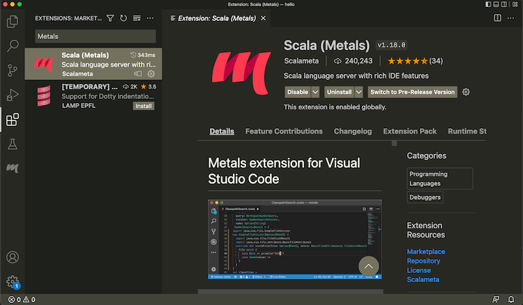
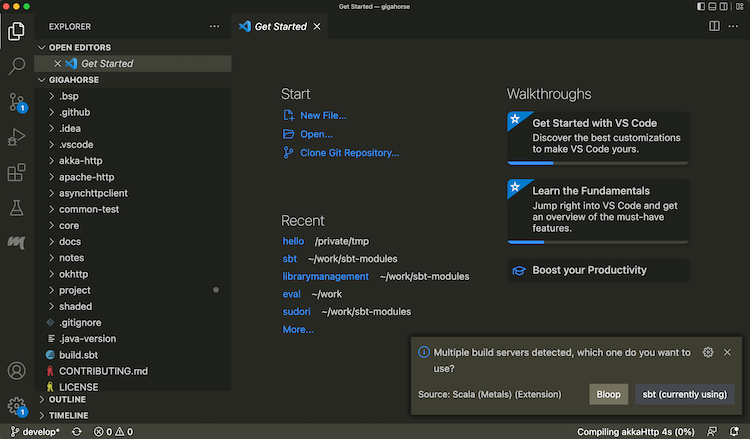
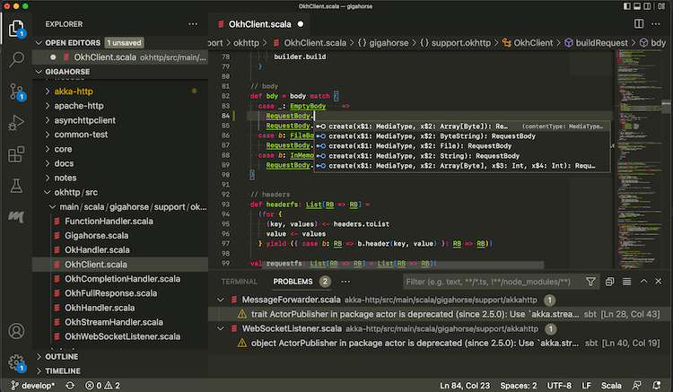
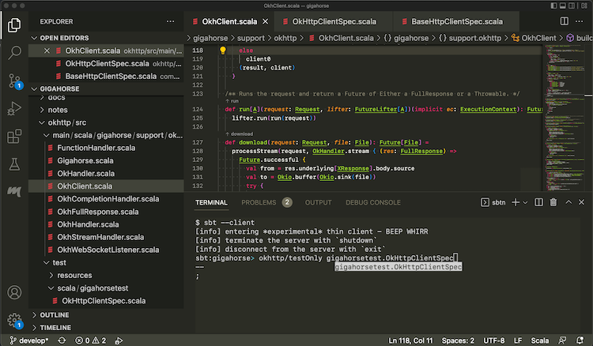
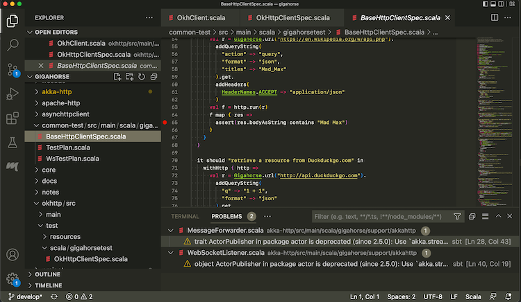
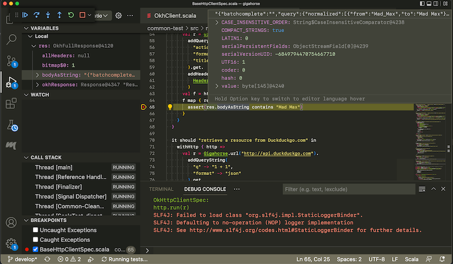

Use sbt as Metals build server
==============================

  [metals]: https://scalameta.org/metals/
  [vscode-debugging]: https://code.visualstudio.com/docs/editor/debugging

Objective
---------

I want to use [Metals][metals] on VS Code with sbt as the build server.

Steps
-----

To use Metals on VS Code:

1. Install Metals from Extensions tab:<br>
   
2. Open a directory containing a `build.sbt` file.
3. From the menubar, run View > Command Palette... (`Cmd-Shift-P` on macOS) "Metals: Switch build server", and select "sbt"<br>
   
4. Once the import process is complete, open a Scala file to see that code completion works:<br>
   

Use the following setting to opt-out some of the subprojects from BSP.

```scala
bspEnabled := false
```

When you make changes to the code and save them (`Cmd-S` on macOS), Metals will invoke sbt to do
the actual building work.

#### Logging into sbt session

While Metals uses sbt as the build server, we can also log into the same sbt session using a thin client.

- From Terminal section, type in `sbt --client`<br>
  

This lets you log into the sbt session Metals has started. In there you can call `testOnly` and other tasks with
the code already compiled.

<!--
#### Interactive debugging on VS Code

1. Metals supports interactive debugging by setting break points in the code:<br>
  
2. Interactive debugging can be started by right-clicking on an unit test, and selecting "Debug Test."
   When the test hits a break point, you can inspect the values of the variables:<br>
   

See [Debugging][vscode-debugging] page on VS Code documentation for more details on how to navigate an interactive debugging session.
-->
